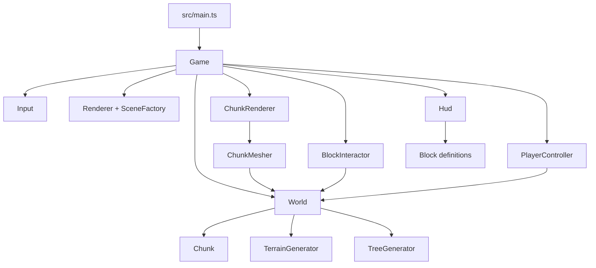
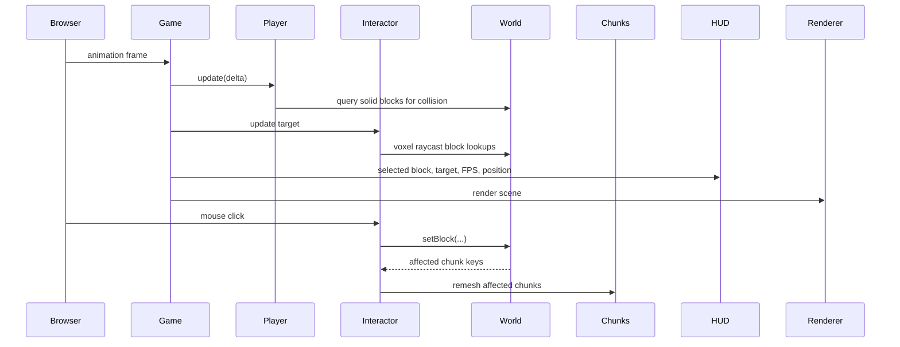
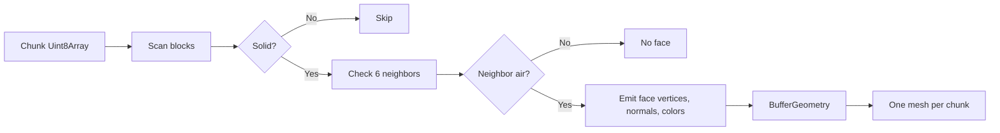

# Architecture

Threecraft is a static browser game. The game loop coordinates browser input, world simulation, chunk mesh rendering, block interaction, and DOM HUD updates.

## Main Boundaries

- `src/game`: top-level orchestration and gameplay constants.
- `src/world`: block IDs, chunk data, terrain generation, tree generation, voxel math, and world lookup/edit APIs.
- `src/rendering`: Three.js renderer, scene/camera creation, chunk mesh lifecycle, and materials.
- `src/player`: keyboard/mouse input and first-person movement/collision.
- `src/interaction`: voxel raycast targeting plus block break/place behavior.
- `src/ui`: DOM HUD and hotbar rendering.
- `src/styles`: global page and HUD styling.

## Data Flow

## Rendering Model

Each chunk stores block IDs in a flat typed array. `ChunkMesher` emits only faces whose neighboring block is air or outside the world. `ChunkRenderer` owns one Three.js mesh per chunk and replaces that mesh when a chunk is remeshed.

## Extension Points

- Add new block types in `Block.ts`, then include placeable blocks in `PLACEABLE_BLOCKS` if players should be able to place them.
- Add terrain features as world-data generation passes before chunk meshes are built.
- Add HUD surfaces in DOM and keep them edge-aligned or compact so the 3D view remains playable.

