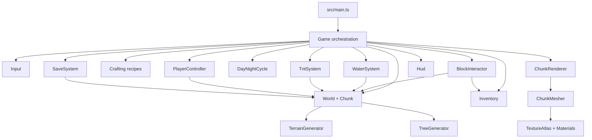
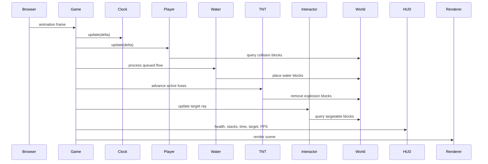
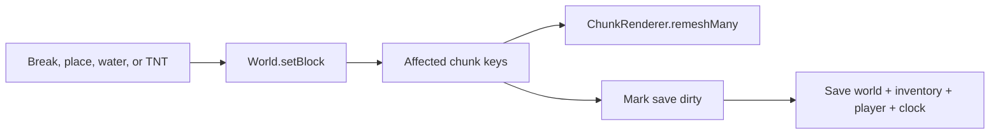
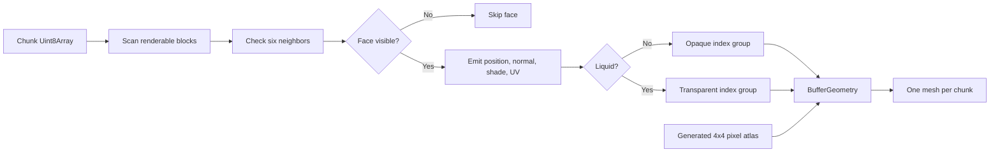
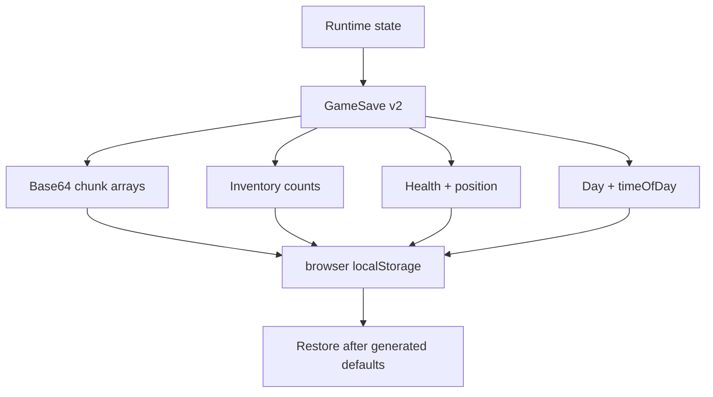

# Architecture

Threecraft is a static browser game. `Game` coordinates input, player simulation, voxel systems, rendering, persistence, and the DOM HUD while each subsystem owns its own state and rules.

## Main Boundaries

- `src/game`: top-level orchestration, day/night simulation, and shared tuning constants.
- `src/world`: block metadata, chunk storage, terrain/trees, voxel math, water, TNT, and world lookup/edit APIs.
- `src/inventory`: finite block stack ownership and serialization.
- `src/crafting`: immutable recipe definitions and inventory transactions.
- `src/persistence`: versioned save types, chunk encoding, restore, and reset.
- `src/rendering`: renderer, scene/camera creation, texture atlas, materials, chunk mesh lifecycle, and geometry generation.
- `src/player`: pointer-lock input, first-person movement, health, fall damage, and collision.
- `src/interaction`: voxel DDA targeting plus break, place, crafting-table, and TNT interactions.
- `src/ui`: DOM HUD, health display, hotbar, crafting dialog, and feedback.
- `src/styles`: global page and HUD styling.
- `scripts`: deterministic system smoke coverage run through Vite's TypeScript loader.

## Frame Data Flow

## World Mutation Flow

Every persistent edit goes through `World.setBlock`. It returns the edited chunk key and any horizontal neighbor key that needs a boundary remesh.

## Rendering Model

Each chunk stores block IDs in a flat `Uint8Array`. `ChunkMesher` emits only visible faces, writes atlas UVs, and places solid and water indices into separate material groups. `ChunkRenderer` owns one mesh per chunk and replaces that mesh after an edit.

## Persistence

`SaveSystem` stores a versioned JSON document under `threecraft-save-v2`. Each 8 KB chunk byte array is base64 encoded; inventory counts, player health/position, and day/time remain structured JSON.

## Extension Points

- Add blocks in `Block.ts`, provide atlas pixels in `TextureAtlas.ts`, and decide whether they belong in `PLACEABLE_BLOCKS`.
- Add world features in `TerrainGenerator` or as a post-generation pass before chunk meshes are built.
- Add persistent state by updating `SaveTypes`, `SaveSystem`, and the save version together.
- Add deterministic system assertions in `scripts/system-smoke.mjs` for simulation changes.
- Keep HUD additions DOM-based and verify both desktop and narrow viewports.
