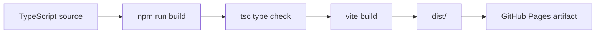
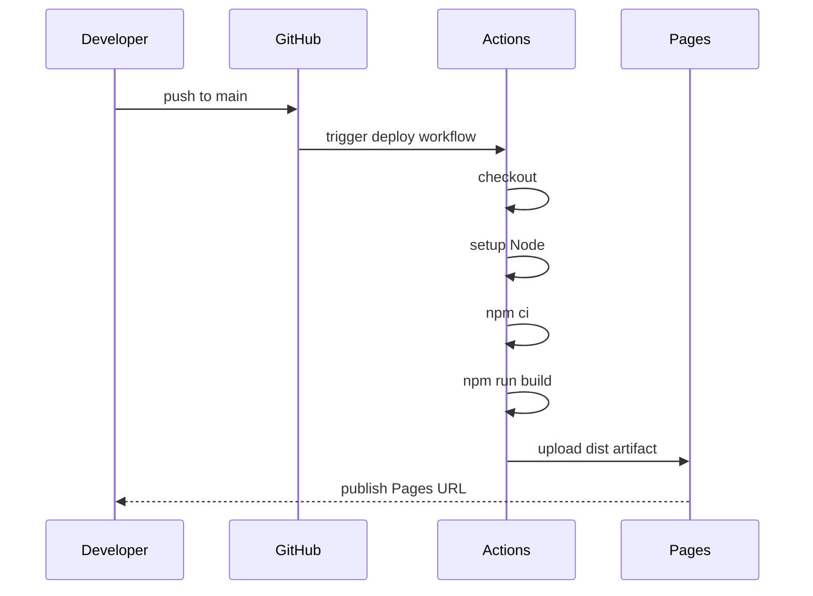

# Deployment

Threecraft is deployed as a static Vite app through GitHub Pages. There is no Node server or backend runtime.

## Build Output



## GitHub Pages Base Path

This repository is configured for a normal repo-based Pages URL:

```txt
https://scottrobertson97.github.io/blocks-game/
```

`vite.config.ts` must keep:

```ts
export default defineConfig({
  base: "/blocks-game/",
});
```

The built `dist/index.html` should reference assets under `/blocks-game/assets/...`.

## GitHub Actions Flow



The workflow lives at `.github/workflows/deploy.yml`.

## Local Verification

Run:

```bash
npm run build
npm run preview
```

Then check the repo-based path:

```txt
http://127.0.0.1:4173/blocks-game/
```

If another local preview already uses `4173`, Vite may choose or require a different port. Use the printed preview URL and append `/blocks-game/`.

## Enable Pages

1. Push the repo to GitHub.
2. Open repository **Settings -> Pages**.
3. Under **Build and deployment**, set **Source** to **GitHub Actions**.
4. Push to `main`.
5. Open the deployed Pages URL after the workflow completes.

