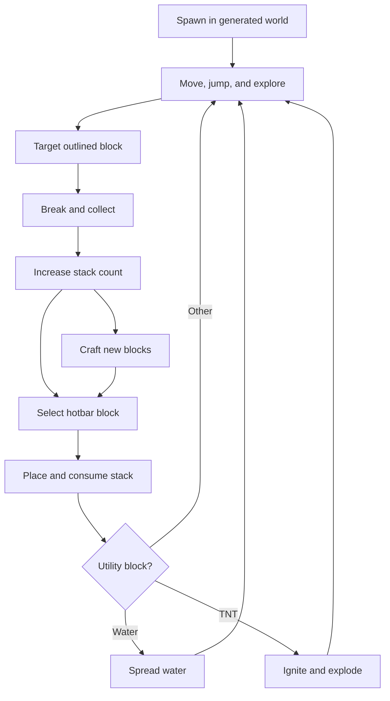
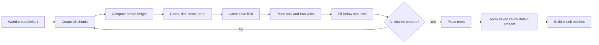
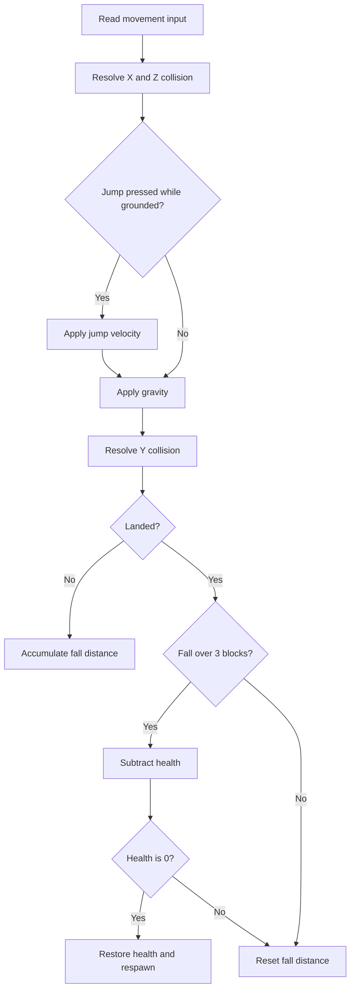
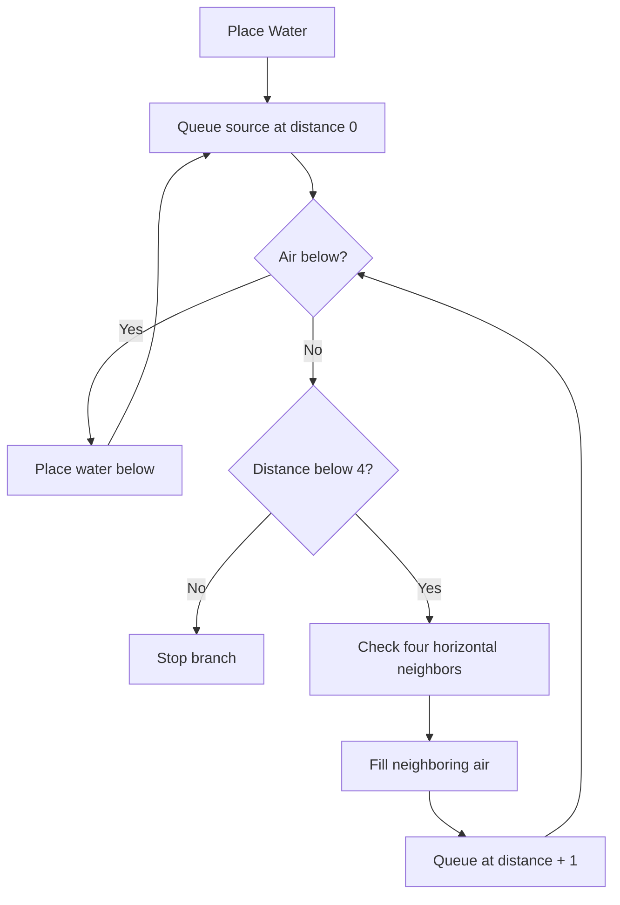
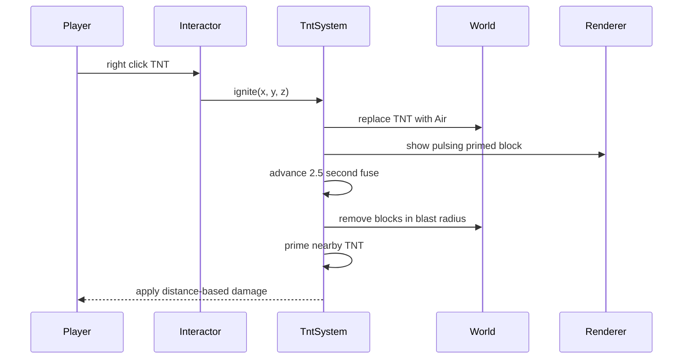

# Gameplay Systems

This document describes the current rules, controls, and subsystem ownership for the playable sandbox.

## Core Loop

## Minecraft-Inspired Feature Set

The ten-feature expansion adds:

1. A white outline around the block under the crosshair.
2. Face-aware pixel textures generated into a runtime atlas.
3. Automatic local save/load for world and player state.
4. Block drops, finite inventory stacks, and placement consumption.
5. Health, fall damage, blast damage, death, and respawn.
6. A four-minute day/night cycle with stars and changing light.
7. Underground caves plus coal and iron ore veins.
8. A crafting panel with inventory-aware recipes.
9. Placeable water that falls and spreads up to four blocks sideways.
10. Craftable TNT with a fuse, terrain destruction, blast damage, and chain reactions.

## World Generation

The default 5x5 chunk world is generated in two stages. `TerrainGenerator` fills each chunk with terrain, caves, ore veins, beach sand, and sea-level water. After every chunk exists, `TreeGenerator` places trunks and leaf canopies across chunk boundaries.

Trees, ores, sand, and water are normal world-data blocks. They use the same targeting, inventory, save, and remesh paths as player-placed blocks.

## Player Movement And Health

The camera is the eye position of a 0.7-block-wide, 1.8-block-tall collision body. `PlayerController` applies mouse look, horizontal movement, gravity, jumping, and axis-separated AABB collision.

Downward travel accumulates as fall distance. Landing after more than three blocks deals one health point per additional whole block. TNT applies distance-based blast damage. Reaching zero health or falling below the world restores 20 health and respawns the player near `(8, 8)`.

## Block Interaction

`BlockInteractor` performs a manual voxel DDA raycast from the camera center with a six-block reach.

- Left click removes the target and adds one matching block to inventory.
- Right click places the selected block in adjacent air and consumes one item.
- Solid placement is rejected when it intersects the player body.
- Right click on a crafting table opens crafting.
- Right click on TNT starts its fuse.
- Holding `Shift` bypasses crafting-table/TNT use and places beside the target.
- Chunk-edge edits remesh both affected chunks.

Water is targetable and renderable but does not collide with the player. Air is neither targetable nor rendered.

## Inventory Hotbar

`PLACEABLE_BLOCKS` in `Block.ts` defines the shared hotbar order:

| Slot | Block | Starting count |
| --- | --- | ---: |
| 1 | Grass | 12 |
| 2 | Dirt | 24 |
| 3 | Stone | 24 |
| 4 | Wood | 10 |
| 5 | Leaves | 10 |
| 6 | Sand | 8 |
| 7 | Coal Ore | 0 |
| 8 | Iron Ore | 0 |
| 9 | Planks | 0 |
| Wheel | Crafting Table | 0 |
| Wheel | Water | 3 |
| Wheel | TNT | 0 |

The mouse wheel cycles all 12 slots. Number keys `1` through `9` select the first nine. Empty slots remain visible but cannot place a block.

## Crafting

Press `E` or use a placed crafting table to open the recipe panel. A recipe button is enabled only when every input stack is sufficient.

| Recipe | Inputs | Output |
| --- | --- | --- |
| Saw Planks | 1 Wood | 4 Planks |
| Crafting Table | 4 Planks | 1 Crafting Table |
| Grass Block | 1 Dirt + 1 Leaves | 1 Grass |
| TNT | 4 Sand + 1 Coal Ore | 1 TNT |

The TNT recipe is intentionally compact for this prototype because there are no hostile-mob drops or gunpowder items yet.

## Water

Natural lakes are generated as static sea-level blocks. A player-placed source enters `WaterSystem`: water falls through air first, then spreads horizontally with a maximum flow distance of four blocks. Flow is processed in small batches so placement does not stall a frame.

Flowing water does not currently recede or store per-block depth levels.

## TNT

Right-clicking TNT removes the stored block and creates a temporary primed entity with a 2.5-second fuse. The explosion removes nearby non-water blocks in an irregular three-block radius, damages a player within six blocks, and primes TNT caught in the blast.

Water blocks are blast-resistant in this simplified model.

## Day, Night, And Saving

One full day lasts four real minutes. `DayNightCycle` advances the HUD clock, moves the directional light, changes sky/fog and ambient intensity, and fades stars in at night.

Persistent edits are saved shortly after a mutation. Position and clock state are also saved periodically. Reloading regenerates the deterministic default world, then replaces its chunk arrays with saved data before rendering.

The crafting panel's **Reset world** command deletes `threecraft-save-v2` and reloads a fresh generated world.
