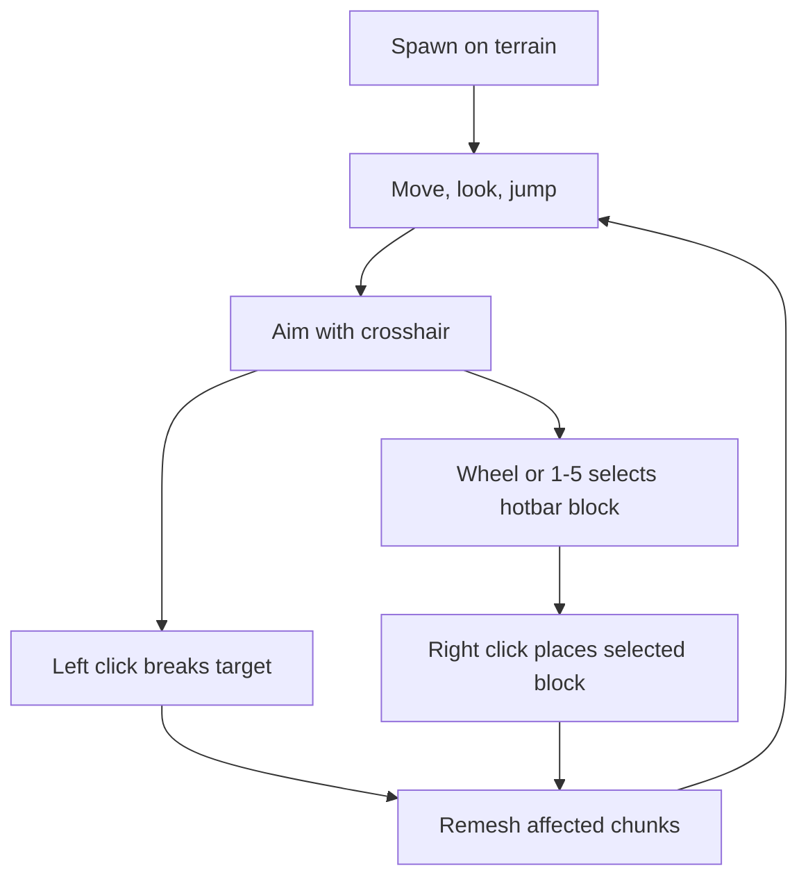
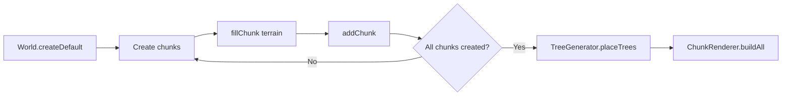
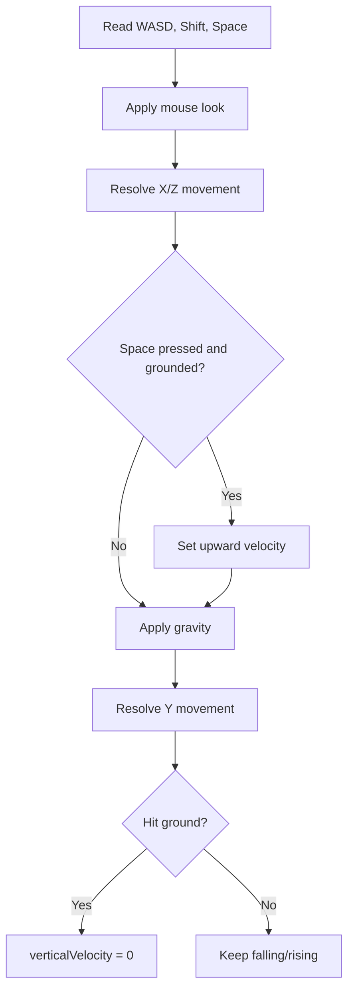

# Gameplay Systems

This document describes the current playable systems and the intended ownership boundaries for future changes.

## Core Loop

## World Generation

The default world is generated in two passes:

1. Terrain generation fills all chunks with grass, dirt, and stone.
2. Tree generation places wood trunks and leaf canopies into the already-created world.

Trees are world-data blocks, not separate meshes. This means they are targeted, broken, placed against, and rendered exactly like terrain blocks.

## Player Movement

The player camera is treated as the eye position of a simple collision body. `PlayerController` applies horizontal movement, gravity, jump velocity, and axis-separated AABB collision against solid blocks.

Movement controls:

- `WASD`: move
- Mouse: look
- `Space`: jump
- `Shift`: faster movement
- `Esc`: release pointer lock

## Block Interaction

`BlockInteractor` raycasts through voxel coordinates from the camera center. The selected hotbar block is placed on the face adjacent to the target block. Placement is rejected if it would intersect the player's collision body.

Editing behavior:

- Left click sets the targeted block to `Air`.
- Right click sets the adjacent block to the selected hotbar block.
- Edited chunks are remeshed.
- If an edit touches a chunk boundary, the neighboring chunk is also remeshed.

## Inventory Hotbar

The creative hotbar is backed by `PLACEABLE_BLOCKS` in `Block.ts`.

Current placeable blocks:

- Grass
- Dirt
- Stone
- Wood
- Leaves

Selection controls:

- Mouse wheel cycles through the hotbar while pointer lock is active.
- `1`-`5` selects a specific slot.
- The selected slot controls right-click placement.

